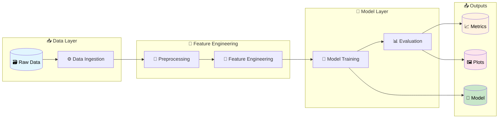

<h1 align="center">🚀 DVC Pipeline Tutorial</h1>

<p align="center">
  <em>A complete Machine Learning pipeline powered by <strong>Data Version Control (DVC)</strong></em>
</p>

<p align="center">
  
  
  
</p>

---

## 📖 Overview

This project demonstrates a **production-ready ML pipeline** using [DVC (Data Version Control)](https://dvc.org/) for data versioning, pipeline orchestration, and experiment tracking. The pipeline performs **text classification** using a Bagging Classifier with comprehensive preprocessing and feature engineering stages.

---

## ✨ Features

| Feature | Description |
|---------|-------------|
| 🔄 **Reproducible Pipelines** | Fully automated ML pipeline with DVC stages |
| 📊 **Experiment Tracking** | DVCLive integration for metrics & plots |
| 🧪 **Version Control** | Data, models, and experiments versioned with DVC |
| 📈 **Visualizations** | Confusion matrix & precision-recall curves |
| ⚙️ **Configurable** | Centralized parameters via `params.yaml` |

---

## 🏗️ Project Structure

```
📦 DVC
├── 📂 data/                    # Data directory (DVC tracked)
│   ├── 📁 raw/                 # Original, immutable data
│   ├── 📁 interim/             # Intermediate transformed data
│   ├── 📁 processed/           # Cleaned data for modeling
│   ├── 📁 features/            # Final feature sets (train/test)
│   └── 📁 external/            # External data sources
│
├── 📂 src/                     # Source code for the pipeline
│   ├── 📁 data/                # Data ingestion scripts
│   │   └── data_ingestion.py
│   ├── 📁 features/            # Feature engineering
│   │   ├── data_preprocessing.py
│   │   └── feature_engineering.py
│   ├── 📁 models/              # Model training & evaluation
│   │   ├── train_model.py
│   │   └── evaluate_model.py
│   └── 📁 visualization/       # Visualization utilities
│
├── 📂 models/                  # Trained models & artifacts
│   ├── 📁 models/              # Serialized model files
│   └── 📁 vectorizers/         # Feature vectorizers (BoW)
│
├── 📂 dvclive/                 # Experiment tracking outputs
│   ├── metrics.json            # Model metrics
│   ├── params.yaml             # Tracked parameters
│   └── 📁 plots/               # Generated visualizations
│
├── 📂 notebooks/               # Jupyter notebooks for EDA
├── 📂 docs/                    # Documentation (Sphinx)
├── 📂 reports/                 # Generated analysis reports
│
├── 📄 dvc.yaml                 # DVC pipeline definition
├── 📄 dvc.lock                 # Pipeline state lock file
├── 📄 params.yaml              # Hyperparameters & config
├── 📄 requirements.txt         # Python dependencies
├── 📄 Makefile                 # Automation commands
└── 📄 setup.py                 # Package setup
```

---

## 🔁 Pipeline Architecture



### Pipeline Stages

| Stage | Script | Description |
|-------|--------|-------------|
| **1. Data Ingestion** | `data_ingestion.py` | Split raw data into train/test sets |
| **2. Preprocessing** | `data_preprocessing.py` | Text cleaning & normalization |
| **3. Feature Engineering** | `feature_engineering.py` | Bag-of-Words vectorization |
| **4. Model Training** | `train_model.py` | Train Bagging Classifier |
| **5. Model Evaluation** | `evaluate_model.py` | Generate metrics & visualizations |

---

## 🚀 Getting Started

### Prerequisites

- Python 3.8+
- Git
- DVC

### Installation

```bash
# 1. Clone the repository
git clone <repository-url>
cd DVC

# 2. Create virtual environment
python -m venv myenv
source myenv/bin/activate  # On Windows: myenv\Scripts\activate

# 3. Install dependencies
pip install -r requirements.txt

# 4. Pull DVC tracked data (if using remote storage)
dvc pull
```

### Running the Pipeline

```bash
# Run entire pipeline
dvc repro

# Run specific stage
dvc repro data_ingestion

# View pipeline DAG
dvc dag
```

---

## ⚙️ Configuration

All hyperparameters are centralized in `params.yaml`:

```yaml
data_ingestion:
  seed: 42
  test_size: 0.25

feature_engineering:
  max_features: 100

model_training:
  estimator:              # Decision Tree params
    max_depth: 25
    min_samples_split: 10
    min_samples_leaf: 5
  bagging:                # Bagging Classifier params
    n_estimators: 250
    max_samples: 0.75
```

---

## 📊 Experiment Tracking

This project uses **DVCLive** for experiment tracking:

```bash
# View experiments
dvc exp show

# Compare experiments
dvc exp diff

# Run experiment with modified params
dvc exp run -S model_training.bagging.n_estimators=300
```

### Tracked Metrics & Plots

- ✅ **Confusion Matrix** - Classification performance visualization
- ✅ **Precision-Recall Curve** - Model threshold analysis
- ✅ **Metrics JSON** - Accuracy, Precision, Recall, F1-Score

---

## 🛠️ Make Commands

```bash
make requirements    # Install dependencies
make clean          # Remove compiled Python files
make lint           # Run flake8 linting
make data           # Generate processed dataset
make help           # Show all available commands
```

---

## 📁 Artifacts

| Artifact | Path | Type |
|----------|------|------|
| Training Dataset | `data/features/train.csv` | Dataset |
| Test Dataset | `data/features/test.csv` | Dataset |
| Bagging Classifier | `models/models/bagging_classifier.joblib` | Model |
| BoW Vectorizer | `models/vectorizers/bow.joblib` | Vectorizer |

---

## 🤝 Contributing

1. Fork the repository
2. Create a feature branch (`git checkout -b feature/amazing-feature`)
3. Commit changes (`git commit -m 'Add amazing feature'`)
4. Push to branch (`git push origin feature/amazing-feature`)
5. Open a Pull Request

---

## 📄 License

This project is licensed under the MIT License - see the [LICENSE](LICENSE) file for details.

---

<p align="center">
  Made with ❤️ using <a href="https://dvc.org/">DVC</a> | <a href="https://scikit-learn.org/">Scikit-learn</a> | <a href="https://www.python.org/">Python</a>
</p>